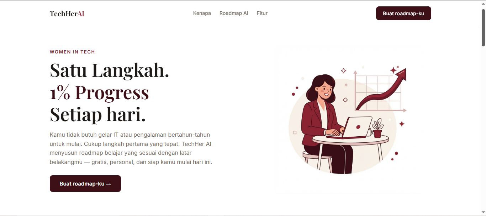

# TechHer AI 💡

**An AI-powered landing page that helps women start their career switch into tech.**

Built as the final project for the **Basic Course: Web & AI for Social Good**, a bootcamp by **Perempuan Inovasi**.

🔗 **Live demo:** [landing-page-tech-her-ai.vercel.app](https://landing-page-tech-her-ai.vercel.app)



> **Note:** The landing page content (copy, form labels, AI-generated output) is in **Bahasa Indonesia**, since the target users are Indonesian women exploring a career switch into tech. This README is written in English for broader accessibility on GitHub.

---

## 📌 Background & Problem

Women's participation in Indonesia's tech industry remains below **20%**, and only around **8%** reach top leadership positions ([Kompas, June 2026](https://money.kompas.com/read/2026/06/06/210250726/perempuan-di-industri-teknologi-ri-baru-20-persen-pimpinan-hanya-8-persen)).

This isn't due to a lack of capability — it's due to limited access to clear career paths, reliable mentorship, and the self-confidence that often has to be built alone throughout the learning process.

**TechHer AI** was built to help close that gap: giving women a clear, personalized starting point — one step at a time.

---

## ✨ Key Features

### 🤖 AI Learning Roadmap Generator
The core feature of this landing page. Users fill in:
- Their current background
- Tech field of interest (web development / data analyst / UI-UX design)
- Available study time per week

The system then generates a **personalized 4-step learning roadmap**, displayed as a visual timeline.

- Connected directly to the **Gemini API** (Google Generative AI), using the `gemini-flash-latest` model alias so it automatically follows Google's latest available Flash model.
- Users provide **their own Gemini API key** (optional, stored only in browser memory — never sent to or stored on any server). This is necessary because the project is fully client-side, so no secret key can be safely embedded in the code.
- If no API key is provided, or the API call fails (e.g. due to free-tier rate limits), the app automatically falls back to a **local rule-based roadmap generator** — ensuring the page always works without errors.

### 🧭 Navigation & Interaction
- Responsive navbar with a mobile hamburger menu toggle
- CTA buttons that scroll users directly to the roadmap generator form

### 🔮 Upcoming Features Preview
Two additional AI features are shown as "coming soon" previews:
- AI Career Assessment
- AI Mock Interview

---

## 🛠️ Tech Stack

| Category | Technology |
|---|---|
| Structure | HTML5 |
| Styling | CSS3 (Grid, Flexbox, custom properties, media queries) |
| Interactivity & Logic | Vanilla JavaScript (no framework) |
| AI | Gemini API — `gemini-flash-latest` |
| Fonts | Playfair Display & Inter (Google Fonts) |
| Deployment | Vercel |

This project is intentionally built without any framework or build tool, so it can run directly in VSCode + Live Server with no extra installation steps.

---

## 📁 File Structure

```
├── index.html      # Page structure & all sections
├── style.css       # Styling, color palette, typography, responsive design
├── script.js       # All interactive logic & Gemini API integration
└── README.md
```

---

## 🚀 Running Locally

1. Clone this repository
   ```bash
   git clone https://github.com/deviputri-data/Landing-Page-TechHerAI.git
   ```
2. Open the project folder in VSCode
3. Right-click `index.html` → **"Open with Live Server"**
4. (Optional) To try the AI Roadmap Generator with a real Gemini API call:
   - Create a free API key at [Google AI Studio](https://aistudio.google.com/apikey)
   - Paste it into the **"Use your own Gemini API key"** field in the roadmap form

---

## 🎯 Target Users

Women who are currently in, or considering, a **career switch into tech**, especially those unsure where to start learning.

---

## ⚠️ Risks & Mitigation

| Risk | Mitigation |
|---|---|
| Roadmap recommendations may not fully match user needs | Users can change their input preferences and regenerate the roadmap anytime |
| User's API key exposure | The API key is never stored on any server — it only lives in browser memory for the current session |
| Third-party AI model deprecation | Uses the `gemini-flash-latest` alias, which automatically follows Google's most current model |

---

## 👩‍💻 Author

**Devi Putri Intansari** — final project for the *Basic Course: Web & AI for Social Good* bootcamp by **Perempuan Inovasi**.

*TechHer AI — built to support women who dare to switch their careers into tech.*
